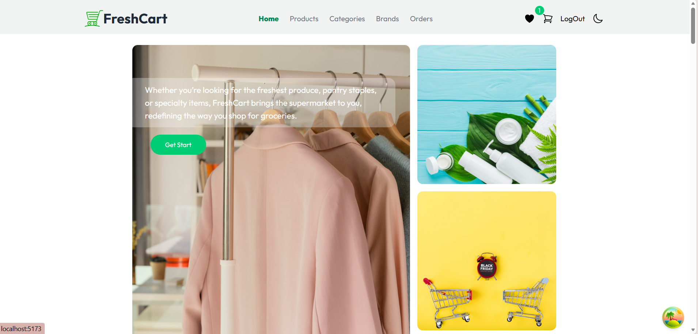
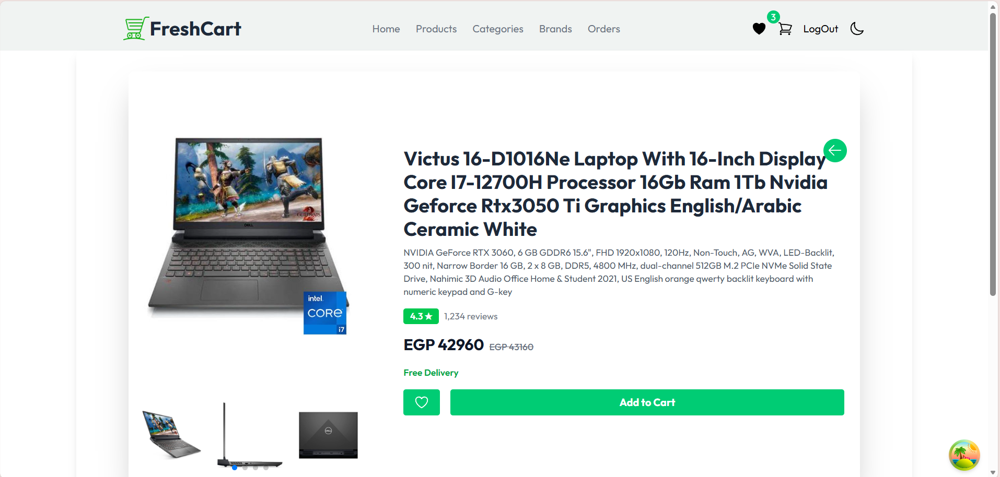
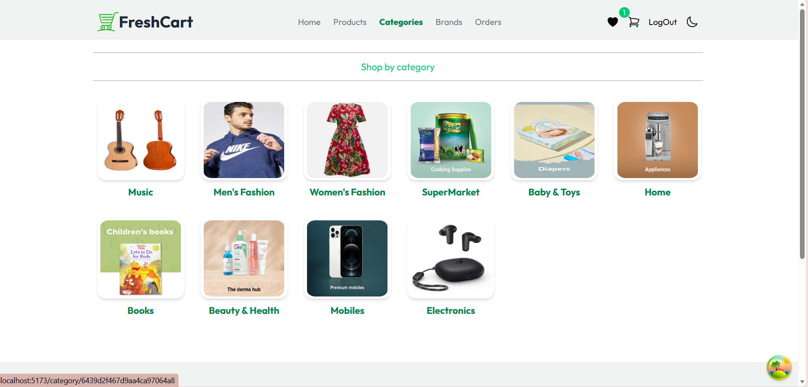
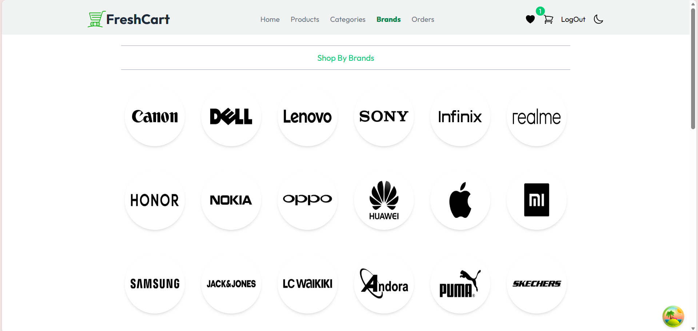
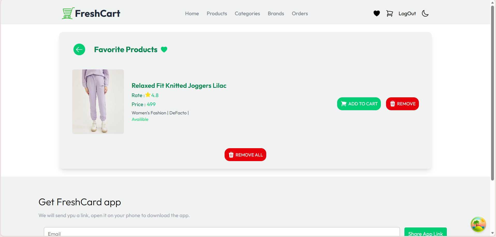
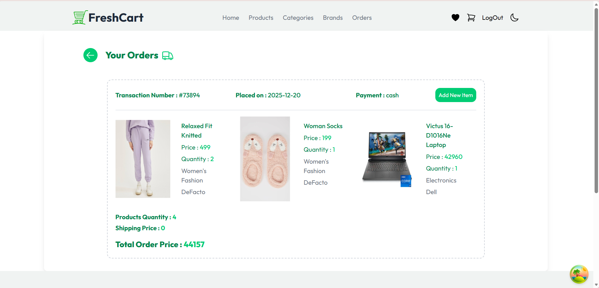

# 🛒 FreshCart – React E-Commerce Application

FreshCart is a **modern, full-featured e-commerce web application** built with **React**.  
It provides a real-world online shopping experience including authentication, product browsing, cart management, wishlist, orders, and checkout — all powered by a real API.

---

## 🚀 Live Demo
🔗 *Add your deployed link here*  
Example: [https://freshcart-react.vercel.app](https://commerce-two-ashen-84.vercel.app)

---

## ✨ Features

- 🔐 **Authentication**
  - Register & Login
  - Forgot & Reset Password
  - Protected Routes

- 🛍️ **Products**
  - Browse all products
  - Product details page
  - Categories & Brands

- ❤️ **Wishlist**
  - Add / Remove products
  - Persistent user wishlist

- 🛒 **Shopping Cart**
  - Add & remove items
  - Update quantities
  - Clear cart
  - Real-time total price

- 📦 **Orders**
  - Checkout process
  - View previous orders

- 🌙 **Dark / Light Mode**
  - Saved in localStorage

- 📱 **Responsive Design**
  - Works on all devices

---

## 🧰 Tech Stack

### Frontend
- React
- React Router v6
- Context API
- React Query (TanStack)
- Axios
- Formik & Yup
- Tailwind CSS
- Animate.css
- React Hot Toast

### Backend API
- RouteMisr E-Commerce API

---

## 🗂️ Project Structure

```bash
src/
├── Components/
├── Context/
├── Pages/
├── App.jsx
└── main.jsx

```
---

## 🔐 Authentication & Authorization

- JWT-based authentication
- Secure token storage in `localStorage`
- Protected routes for authenticated users only
- Automatic session verification on app load

---

## 📦 State Management

### Context API
Used for managing:
- Authentication
- Cart
- Wishlist

### React Query
Used for:
- API data fetching
- Caching & background updates
- Loading & error handling

---

## ⚙️ Installation & Run Locally

```bash
# Clone the repository
git clone https://github.com/your-username/freshcart-react.git

# Navigate to the project directory
cd freshcart-react

# Install dependencies
npm install

# Run the app
npm run dev
```
## 📸 Screenshots

The following screenshots demonstrate the core features and user interfaces of the application.

| Page | Screenshot |
|-----|------------|
| **Home Page**<br/>Main landing page displaying featured products and navigation |  |
| **Product Details**<br/>Detailed view of a selected product |  |
| **Categories**<br/>Browse products by category |  |
| **Brands**<br/>Explore products by brand |  |
| **Shopping Cart**<br/>View and manage selected products before checkout |  |
| **Wishlist**<br/>Save favorite products for later |  |
| **Orders**<br/>View order history and order details |  |
| **Login Page**<br/>User authentication interface |  |

---

## 👥 Contributors

Thanks to all contributors who helped build this project:

- [@Hagaratef4](https://github.com/Hagaratef4)
- [@yaraelfeky](https://github.com/yaraelfeky)
- [@monicamaged5](https://github.com/monicamaged5)
- [@muhmdxFlutter](https://github.com/muhmdxFlutter)
- [@mohamed-dev-404](https://github.com/mohamed-dev-404)
- [@Yomna-Abdelmegeed](https://github.com/Yomna-Abdelmegeed)


